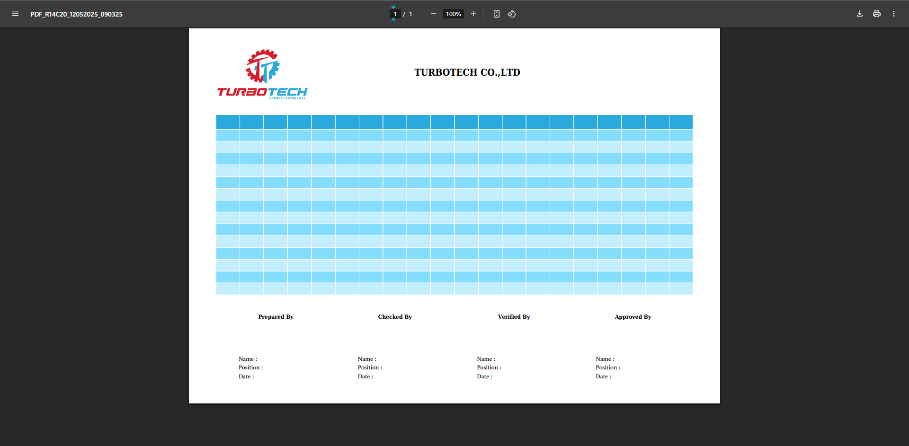

# Template Class Documentation

A PHP class for generating PDF documents using mPDF with support for Khmer fonts and custom templates.

## Class Properties

- `$viewDir`: Directory path for view templates
- `$fontDir`: Directory path for custom fonts
- `$termDir`: Directory path for temporary files
- `$views`: Array of default view templates for header, footer, and body

## Methods

### view(string $viewName, array $data = []): string
Renders a blade template view with provided data.

### config(...$arg): array
Configures mPDF settings with custom fonts and format options. Handles:
- Font directories and custom font definitions
- Page orientation and size settings
- Script and language handling
- Default margins and padding

### setHeader($mpdf, $header = null): void
Sets the HTML header for the mPDF document.
- `$mpdf`: mPDF instance
- `$header`: Optional custom HTML header content

### setFooter($mpdf, $footer = null): void
Sets the HTML footer for the mPDF document.
- `$mpdf`: mPDF instance
- `$footer`: Optional custom HTML footer content

### setDraft($mpdf, $draft = null): void
Applies a watermark to the PDF document.
- `$mpdf`: mPDF instance
- `$draft`: Optional custom watermark text (defaults to 'Draft')

### example(Request $request): void
Generates and outputs a PDF document with configurable:
- Number of rows and columns
- Page orientation (L/P)
- Title and headers
- Copy/print protection

### useERP(...$args): void
Generates PDF using ERP template with:
- Customizable headers and company info
- Flexible row limits for landscape/portrait
- Dynamic footer positioning
- Automatic title generation with timestamp

## Supported Fonts

- khmerosmoullight (Khmer OS Muol Light)
- khmeroscontent (Khmer OS Content)
- content (Regular and Bold)
- timenewroman (Regular, Bold, Italic, Bold Italic)
- ttstandinvoice (Content Times New Roman)

## Example Usage


### Installation

You can install the package via composer:

```bash
composer require smarterp-dev/pdf-template
```

### Usage

```php
<?php
use Turbotech\PDFTemplate\PDFTemplate;
    Route::get('/pdf', function (Request $request) {
        $total = 14;
        $subHeaderTitle = "As Period: 2023 - 2024";
        $headerTitle = "SUMMARY REPORT ON CASH FLOW FROM OPERATING ACTIVITIES";

        // Example string Content
        $content = "Hello World!";

        // OR Example HTML Content get from view
        $content = view('templates.body', [
            'rows' => $total,
            'cols' => 20,
        ]);

        // Example:
        // return Template::example($request);


        // Use Template
        return Template::useERP(
            [
                'orientation' => 'L', // L = Landscape, P = Portrait
                'header_company' => 'TURBOTECH CO.,LTD',
                'header_title' => $headerTitle,
                'sub_header_title' => $subHeaderTitle,
                'rows' => $total,
                'body' => $content,
            ]
        );

    });
```

## License
The MIT License (MIT). Please see License File for more information.